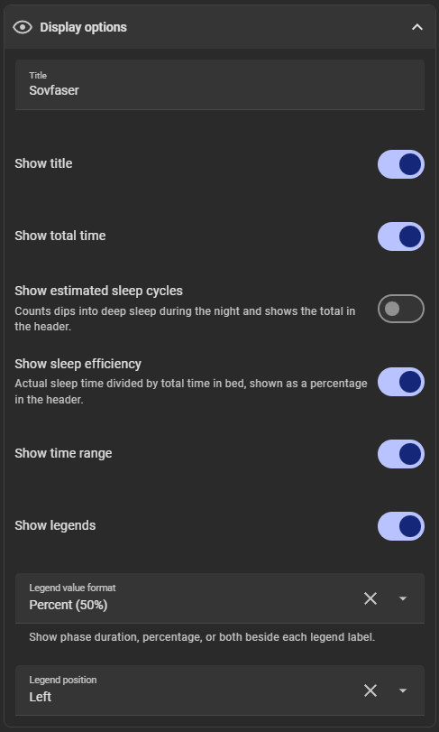
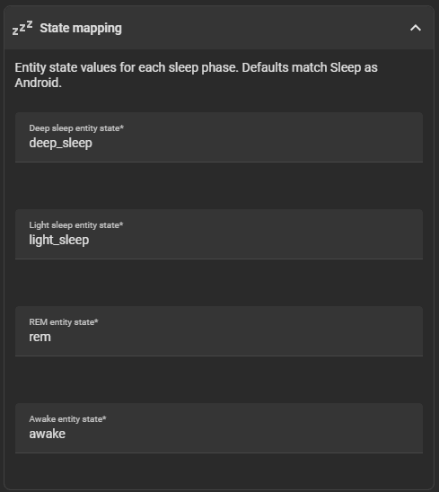
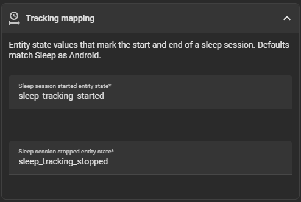

# Hypnogram Card

A custom [Home Assistant](https://www.home-assistant.io/) Lovelace card that visualizes your latest sleep session as a hypnogram; a stacked chart of sleep phases over time.


## What is it for?

The card reads history from a sleep-related sensor entity and turns phase changes (deep sleep, light sleep, REM, awake) into a compact, readable chart. It helps you see at a glance how your night looked: when you fell asleep, how long each phase lasted, and when you woke up.

## Who is it for?

This card is aimed at Home Assistant users who track sleep and want a visual summary on their dashboard, not just a text state or numeric score.

**Works out of the box** with [Sleep as Android](https://sleep.urbandroid.org/) via its Home Assistant integration. The default state mapping matches Sleep as Android entity states (`deep_sleep`, `light_sleep`, `rem`, `awake`).

If you use another integration that reports sleep phases differently, you can remap entity states in the card editor under **State mapping** and **Tracking mapping**.

## Features

- Hypnogram chart with deep sleep, light sleep, REM, and awake phases
- Optional title, total sleep duration (h:mm), and period time range (respects your HA 12h/24h setting)
- Optional phase legend with duration, percentage, or both beside each label, positioned left or right
- Optional sleep efficiency (%) and estimated sleep cycle count in the header
- Chart color based on a single primary color. Phase shades are derived automatically (static value or Jinja2 template)
- Bucket size (1–30 minutes) to smooth short phase changes
- Tap, hold, and double-tap actions (e.g. open more-info)
- Visual card editor with grouped settings
- Localized UI (see [Language support](#language-support))

## Screenshots

| Card editor                                                                  |
| ---------------------------------------------------------------------------- |
|  |
|  |
|  |

| Dashboard examples                                                    |
| --------------------------------------------------------------------- |
|    |
|  |
|  |

## Requirements

- Home Assistant with Lovelace dashboards
- A sensor entity that records sleep phase changes in its history (typically updated by a sleep tracking integration)

### Official Sleep as Android (event-based) note

The official [Sleep as Android integration](https://www.home-assistant.io/integrations/sleep_as_android/) exposes sleep phases as `event.*` entities (not `sensor.*`), while this card requires a `sensor.*` entity with reliable history.

To use the card with the official integration, create a small helper `template` sensor that merges:

1. `event.sleep_as_android_sleep_phase` (deep_sleep/light_sleep/rem/awake, etc.)
2. `event.sleep_as_android_sleep_tracking` (started/stopped)

into a single `sensor.*` with state changes.

Quick steps (UI helper):

1. Settings -> Devices & services -> Helpers -> Create helper -> Template -> Sensor
2. Name it (e.g. `Sleep as Android Hypnogram`)
3. In `State`, paste the template below (keep the `event.*` entity_ids as needed):

```yaml



  sleep_tracking_started

  sleep_tracking_stopped

  {{ phase }}

  unknown

```

Then set the card `entity` to the helper sensor (e.g. `sensor.sleep_as_android_hypnogram`).

Notes:

- Only `deep_sleep`, `light_sleep`, `rem`, and `awake` are emitted as phases; everything else (including `not_awake`) becomes `unknown` and is ignored by the card.
- If your event entity IDs differ, update them in the template.

## Installation

### HACS (recommended)

1. Add this repository as a [custom repository](https://hacs.xyz/docs/faq/custom_repositories/) in HACS (**Frontend** category): `https://github.com/Lavve/lovelace-hypnogram-card`
2. Search for **Hypnogram Card** and install it.
3. Add the card resource if prompted, or reload your dashboard.

[](https://my.home-assistant.io/redirect/hacs_repository/?owner=Lavve&repository=lovelace-hypnogram-card)

### Manual

1. Download `hypnogram-card.js` from the [latest release](https://github.com/Lavve/lovelace-hypnogram-card/releases) (or build it locally, see [Development](#development)).

2. Copy the file to your Home Assistant `config/www/` folder.

3. Add a Lovelace resource:
   
   ```yaml
   url: /local/hypnogram-card.js
   type: module
   ```

4. Reload Home Assistant or clear your browser cache.

## Usage

### Visual editor

1. Edit your dashboard and add a new card.
2. Search for **Hypnogram Card** (or add it via **Manual** if needed).
3. Select your sleep sensor entity.
4. Adjust display, chart, and interaction options as needed.


### YAML example

```yaml
type: custom:hypnogram-card
entity: sensor.sleep_as_android_cson
title: Today
show_title: true
show_period_range: true
show_total_time: true
show_labels: true
legend_format: both
legend_position: left
show_sleep_efficiency: true
show_sleep_cycles: true
primary_color: #3366aa
bucket_minutes: 30
tap_action:
  action: more-info
hold_action:
  action: none
double_tap_action:
  action: none
state_mapping:
  deep_sleep: deep_sleep
  light_sleep: light_sleep
  rem: rem
  awake: awake
tracking_mapping:
  started: sleep_tracking_started
  stopped: sleep_tracking_stopped
```

### Configuration options

| Option                  | Type                                        | Default                   | Description                                                                                                    |
| ----------------------- | ------------------------------------------- | ------------------------- | -------------------------------------------------------------------------------------------------------------- |
| `entity`                | string                                      | *required*                | Sensor entity with sleep phase history                                                                         |
| `title`                 | string                                      | `Today`                   | Card title (shown when `show_title` is enabled)                                                                |
| `show_title`            | boolean                                     | `true`                    | Show or hide the title                                                                                         |
| `show_period_range`     | boolean                                     | `true`                    | Show sleep start/end time in the header                                                                        |
| `show_total_time`       | boolean                                     | `true`                    | Show total sleep duration as h:mm in the header (requires `show_title`)                                        |
| `show_labels`           | boolean                                     | `false`                   | Show phase legend beside the chart                                                                             |
| `legend_format`         | `none` \| `percent` \| `duration` \| `both` | `none`                    | Values shown beside legend labels (requires `show_labels`)                                                     |
| `legend_position`       | `left` \| `right`                           | `left`                    | Legend placement (only when labels are shown)                                                                  |
| `show_sleep_efficiency` | boolean                                     | `false`                   | Show sleep efficiency (%) in the header                                                                        |
| `show_sleep_cycles`     | boolean                                     | `false`                   | Show estimated sleep cycle count in the header                                                                 |
| `primary_color`         | string                                      | `var(--primary-color)`    | Base chart color (hex, rgb, color name, CSS variable, or Jinja2 template). Phase colors are derived from this. |
| `bucket_minutes`        | number                                      | `30`                      | Group phase changes into time buckets (1–30 minutes) for a smoother chart                                      |
| `tap_action`            | action                                      | `more-info`               | Action on tap                                                                                                  |
| `hold_action`           | action                                      | `none`                    | Action on hold                                                                                                 |
| `double_tap_action`     | action                                      | `none`                    | Action on double tap                                                                                           |
| `state_mapping`         | object                                      | Sleep as Android defaults | Maps entity states to internal phase names                                                                     |
| `tracking_mapping`      | object                                      | Sleep as Android defaults | Entity states that mark the start and end of a sleep session                                                   |

> **Note:** `show_legend_percentages` is deprecated. Use `legend_format: percent` instead. Existing configs are migrated automatically in the visual editor.

**Sleep efficiency** is calculated as actual sleep time (all phases except awake) divided by total time in bed.

**Sleep cycles** are estimated by counting how many times the chart dips into deep sleep during the night.

### Dynamic chart color (template)

`primary_color` can be a Jinja2 template. In the visual editor, type `{{` or `{%` in the chart color field to switch to template mode (remove Jinja syntax to switch back to a static color).

The card exposes the full card config as `config` in templates, so you can reference `config.entity` and any other Home Assistant template helpers (`states()`, `is_state()`, etc.).

Example: color the chart by total sleep duration from a helper sensor, red if under 6 hours, orange if under 7 hours, otherwise green:

```yaml
type: custom:hypnogram-card
entity: sensor.sleep_phases
primary_color: >-
  
  
    var(--error-color)
  
    rgb(255 165 0)
  
    #008000
  
```

Replace `sensor.sleep_duration` with your own sensor that reports sleep length in hours (e.g. from Sleep as Android, a template sensor, or an integration attribute).

### State and tracking mapping

The card expects history entries whose states can be mapped to four phases: `deep_sleep`, `light_sleep`, `rem`, and `awake`. It also uses tracking events to find the latest sleep window. By default `sleep_tracking_started` and `sleep_tracking_stopped` (Sleep as Android).

If your integration uses different state strings, configure **State mapping** and **Tracking mapping** in the editor:

```yaml
state_mapping:
  deep_sleep: deep
  light_sleep: light
  rem: rem
  awake: awake
tracking_mapping:
  started: tracking_on
  stopped: tracking_off
```

## Language support

The card follows your Home Assistant profile language. Strings fall back to English when a translation is missing.

| Language           | Code | Status    |
| ------------------ | ---- | --------- |
| English            | `en` | Default   |
| Norwegian (Bokmål) | `nb` | Supported |
| Swedish            | `sv` | Supported |

Time formatting (12h/24h) uses Home Assistant's locale settings automatically.

### Adding a new language

See [`CONTRIBUTING.md`](./CONTRIBUTING.md#translations) for the latest translation instructions.

## Development

```bash
pnpm install
pnpm build      # outputs dist/hypnogram-card.js
pnpm watch      # rebuild on changes
pnpm lint       # check with Biome
```

Copy `dist/hypnogram-card.js` to your HA `www/` folder for local testing.

## License

MIT
