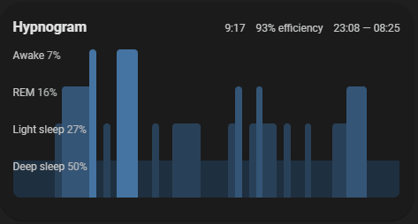
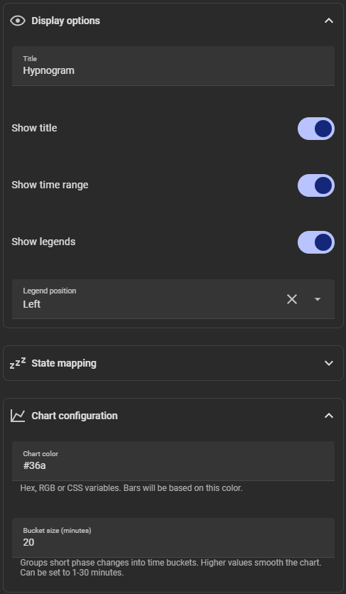
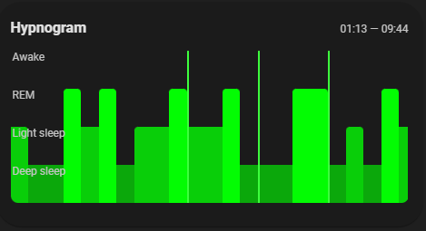
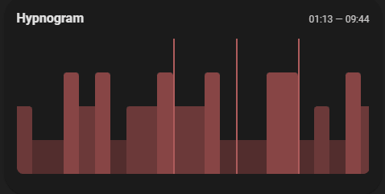
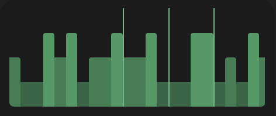

# Hypnogram Card

A custom [Home Assistant](https://www.home-assistant.io/) Lovelace card that visualizes your latest sleep session as a hypnogram — a stacked chart of sleep phases over time.



## What is it for?

The card reads history from a sleep-related sensor entity and turns phase changes (deep sleep, light sleep, REM, awake) into a compact, readable chart. It helps you see at a glance how your night looked: when you fell asleep, how long each phase lasted, and when you woke up.

## Who is it for?

This card is aimed at Home Assistant users who track sleep and want a visual summary on their dashboard, not just a text state or numeric score.

**Works out of the box** with [Sleep as Android](https://sleep.urbandroid.org/) via its Home Assistant integration. The default state mapping matches Sleep as Android entity states (`deep_sleep`, `light_sleep`, `rem`, `awake`).

If you use another integration that reports sleep phases differently, you can remap entity states in the card editor under **State mapping**.

## Features

- Hypnogram chart with deep sleep, light sleep, REM, and awake phases
- Optional title and sleep period time range (respects your HA 12h/24h setting)
- Optional phase legend with optional percentages, positioned left or right
- Chart color based on a single primary color — phase shades are derived automatically (static value or Jinja2 template)
- Bucket size (1–30 minutes) to smooth short phase changes
- Tap, hold, and double-tap actions (e.g. open more-info)
- Visual card editor with grouped settings
- Localized UI (see [Language support](#language-support))

## Screenshots

<table>
  <thead>
    <tr>
      <th>Dashboard</th>
      <th>Card editor</th>
    </tr>
  </thead>
  <tbody>
    <tr>
      <td></td>
      <td rowspan="4" style="vertical-align: top;"></td>
    </tr>
    <tr>
      <td></td>
    </tr>
    <tr>
      <td></td>
    </tr>
    <tr>
      <td></td>
    </tr>
  </tbody>
</table>

## Requirements

- Home Assistant with Lovelace dashboards
- A sensor entity that records sleep phase changes in its history (typically updated by a sleep tracking integration)

## Installation

### HACS (recommended)

1. Add this repository as a [custom repository](https://hacs.xyz/docs/faq/custom_repositories/) in HACS (**Frontend** category): `https://github.com/Lavve/lovelace-hypnogram-card`
2. Search for **Hypnogram Card** and install it.
3. Add the card resource if prompted, or reload your dashboard.

[](https://my.home-assistant.io/redirect/hacs_repository/?owner=Lavve&repository=lovelace-hypnogram-card)

### Manual

1. Download `hypnogram-card.js` from the [latest release](https://github.com/Lavve/lovelace-hypnogram-card/releases) (or build it locally — see [Development](#development)).

2. Copy the file to your Home Assistant `config/www/` folder.

3. Add a Lovelace resource:

   ```yaml
   url: /local/hypnogram-card.js
   type: module
   ```

4. Reload Home Assistant or clear your browser cache.

## Usage

### Visual editor

1. Edit your dashboard and add a new card.
2. Search for **Hypnogram Card** (or add it via **Manual** if needed).
3. Select your sleep sensor entity.
4. Adjust display, chart, and interaction options as needed.


### YAML example

```yaml
type: custom:hypnogram-card
entity: sensor.sleep_as_android_cson
title: Today
show_title: true
show_period_range: true
show_labels: true
legend_position: left
primary_color: #3366aa
bucket_minutes: 30
tap_action:
  action: more-info
hold_action:
  action: none
double_tap_action:
  action: none
state_mapping:
  deep_sleep: deep_sleep
  light_sleep: light_sleep
  rem: rem
  awake: awake
```

### Configuration options

| Option              | Type              | Default                   | Description                                                                       |
| ------------------- | ----------------- | ------------------------- | --------------------------------------------------------------------------------- |
| `entity`            | string            | *required*                | Sensor entity with sleep phase history                                            |
| `title`             | string            | `Today`                   | Card title (shown when `show_title` is enabled)                                   |
| `show_title`        | boolean           | `true`                    | Show or hide the title                                                            |
| `show_period_range` | boolean           | `true`                    | Show sleep start/end time in the header                                           |
| `show_labels`             | boolean           | `false`                   | Show phase legend beside the chart                                                |
| `show_legend_percentages` | boolean           | `false`                   | Show each phase as a percentage in the legend (requires `show_labels`)            |
| `legend_position`         | `left` \| `right` | `left`                    | Legend placement (only when labels are shown)                                     |
| `primary_color`     | string            | `var(--primary-color)`    | Base chart color (hex, rgb, CSS variable, or Jinja2 template). Phase colors are derived from this. |
| `bucket_minutes`    | number            | `30`                      | Group phase changes into time buckets (1–30 minutes) for a smoother chart         |
| `tap_action`        | action            | `more-info`               | Action on tap                                                                     |
| `hold_action`       | action            | `none`                    | Action on hold                                                                    |
| `double_tap_action` | action            | `none`                    | Action on double tap                                                              |
| `state_mapping`     | object            | Sleep as Android defaults | Maps entity states to internal phase names                                        |

### Dynamic chart color (template)

`primary_color` can be a Jinja2 template. In the visual editor, type `{{` or `{%` in the chart color field to switch to template mode (remove Jinja syntax to switch back to a static color).

The card exposes the full card config as `config` in templates, so you can reference `config.entity` and any other Home Assistant template helpers (`states()`, `is_state()`, etc.).

Example: color the chart by total sleep duration from a helper sensor — red if under 6 hours, orange if under 7 hours, otherwise green:

```yaml
type: custom:hypnogram-card
entity: sensor.sleep_phases
primary_color: >-
  
  
    red
  
    orange
  
    green
  
```

Replace `sensor.sleep_duration` with your own sensor that reports sleep length in hours (e.g. from Sleep as Android, a template sensor, or an integration attribute).

### State mapping

The card expects history entries whose states can be mapped to four phases: `deep_sleep`, `light_sleep`, `rem`, and `awake`. It also recognizes tracking events (`sleep_tracking_started` / `sleep_tracking_stopped`) to find the latest sleep window.

If your integration uses different state strings, configure **State mapping** in the editor so each phase points to the correct entity state value.

## Language support

The card follows your Home Assistant profile language. Strings fall back to English when a translation is missing.

| Language | Code | Status    |
| -------- | ---- | --------- |
| English  | `en` | Default   |
| Swedish  | `sv` | Supported |

Time formatting (12h/24h) uses Home Assistant's locale settings automatically.

### Adding a new language

Contributions are welcome. To add a language, open a pull request on [GitHub](https://github.com/Lavve/lovelace-hypnogram-card):

1. Copy `src/locales/en.ts` to `src/locales/<code>.ts` using the [ISO 639-1](https://en.wikipedia.org/wiki/List_of_ISO_639-1_codes) language code (e.g. `de.ts` for German).
2. Translate every string value. Keep the keys unchanged.
3. Register the new locale in `src/locales/localize.ts`:
   - import your file
   - add it to the `languages` object with the same code
4. Run `pnpm lint` and `pnpm build` to verify everything passes.
5. Submit the PR with the language name in the title (e.g. "Add German translation").

If your language has regional variants in Home Assistant (e.g. `pt-BR`), use the same code HA reports in `hass.locale.language`.

## Development

```bash
pnpm install
pnpm build      # outputs dist/hypnogram-card.js
pnpm watch      # rebuild on changes
pnpm lint       # check with Biome
```

Copy `dist/hypnogram-card.js` to your HA `www/` folder for local testing.

## License

MIT
